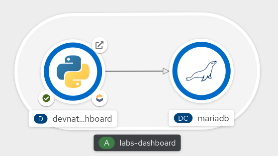

# DevNation Labs (HOWL) Dashboard

Python tiny CRUD application with Flask, SQLAlchemy and Bootstrap to assign clusters for [HOWL](https://developers.redhat.com/devnation/labs/openshift-howl) Labs.

It uses MariaDB as DB.



## Local Development


### Setup MariaDB

Get MariaDB from Dockerhub:

```
docker pull mariadb
```

Run MariaDB:
```
docker run --rm -d --name mariadb -v /some/local/dir:/var/lib/mysql:z -p 3306:3306 -e MYSQL_ROOT_PASSWORD=foo -ti mariadb
```

### Setup Python

Start local Python 3 env:

```
virtualenv --python=/usr/bin/python3 venv
source ./venv/bin/activate
pip3 install -r requirements.txt
```

### Run locally

#### Run Migrations

```
python manage.py db init
DB_USER=user DB_PASS=pass DB_HOST=127.0.0.1 DB_NAME=cluster_booking python manage.py db migrate
DB_USER=user DB_PASS=pass DB_HOST=127.0.0.1 DB_NAME=cluster_booking python manage.py db upgrade
```

#### Run the app
 
```
DB_USER=user DB_PASS=pass DB_HOST=127.0.0.1 DB_NAME=cluster_booking ADMIN_USER=foo@web.tld ADMIN_PASS=foo python app.py
```

Open at your Web browser the following link http://127.0.0.1:8080


### Docker/Podman

The `docker-entrypoint.sh` is not initializating the db by default, you can do it with adding this ENV the first time:

```INIT_DB=yes```

#### Build

```
docker build -f Dockerfile.alpine -t devnation-labs:latest
```


#### Run

```
docker run -e DB_USER="mariadb" -e DB_PASS="mariadb" -e DB_HOST="<SERVICE_OR_LAN_IP>" -e ADMIN_USER=foo@web.tld -e ADMIN_PASS=foo -p 8080:8080 -ti devnation-labs
```

## OpenShift


### Create a new project

```
oc new-project devnation-labs
```

### Get MariaDB

```
oc new-app mariadb-persistent -p DATABASE_SERVICE_NAME=mariadb -p MYSQL_USER=mariadb -p MYSQL_PASSWORD=mariadb -p MYSQL_ROOT_PASSWORD=mariadb -p MYSQL_DATABASE=cluster_booking
```

### Deploy

Overriding S2I run script at `.s2i/bin/run` to run migrations and start the app.

#### ENV vars as parameters to the Deployment


Default parameters are stored as ENV vars in [config.py](config.py#).

List of variables to use for a deployment:

| ENV | Default value | Description
| ------------- | ------------- | ------------- |
| `DB_USER`  | `mariadb`  | MariaDB username
| `DB_PASS`  | `mariadb`  | MariaDB password
| `DB_HOST`  | `mariadb`  | MariaDB hostname
| `DB_NAME`  | `cluster_booking`  | DB name
| `ADMIN_USER`  | `admin@email.tld`  | Default admin username **CHANGE IT**
| `ADMIN_PASS`  | `_some_difficult_pass@`  | Default admin password **CHANGE IT**
| `SECRET_KEY`  | `2621a03cd4e5881cac070d675dac75d2d973c46f466aa1b5`  | Default secret key **CHANGE IT**

#### Generate Session Secret Key


You should avoid using default `SECRET_KEY` from [config.py](config.py#L6), which defaults to a Dev-only one. For Prod envs, you can generate a new one with this command:

```
export SECRET_KEY=`openssl rand -hex 24`
```

#### oc new-app

```
oc new-app https://github.com/redhat-scholars/devnation-labs-dashboard.git -e DB_USER=mariadb -e DB_PASS=mariadb -e DB_HOST=mariadb -e DB_NAME=cluster_booking -e ADMIN_USER=foo@web.tld -e ADMIN_PASS=foo -e SECRET_KEY=$SECRET_KEY
oc create route edge --service=devnation-labs-dashboard --insecure-policy=Redirect 

```

#### Upload from local working dir (Optional)

```
oc new-build --name devnation-labs -i python --binary=true
oc start-build devnation-labs --from-dir=.
oc new-app devnation-labs -e DB_USER=mariadb -e DB_PASS=mariadb -e DB_HOST=mariadb -e DB_NAME=cluster_booking -e ADMIN_USER=foo@web.tld -e ADMIN_PASS=foo -e SECRET_KEY=$SECRET_KEY
oc create route edge --service=devnation-labs --insecure-policy=Redirect 
```

#### odo (Experimental)

odo should been able to [link services](https://docs.openshift.com/container-platform/latest/cli_reference/developer_cli_odo/creating-instances-of-services-managed-by-operators.html#listing-available-services-from-the-operators-installed-on-the-cluster_creating-instances-of-services-managed-by-operators) like MariaDB, however there's no MariaDB yet inside OCP OperatorHub.

```
odo project create devnation-labs
odo create python --s2i
odo push
odo url create --port 8080 --secure
odo push
```

### Admin user

By default there's only one Admin user, default credentials are stored in [config.py](config.py#L11)

If you want to change those, a [new Admin](https://github.com/redhat-scholars/devnation-labs-dashboard/blob/master/app.py#L331) will be created using these ENV:

- `ADMIN_USER`: some email used as username
- `ADMIN_PASS`: some pass

## Paths

### Web

- `/`: Student cluster booking form
- `/admin/panel`: Administrator panel (Upload clusters and users via CSV, assigning manually clusters)
- `/admin/login`: Administrator login

### REST (@protected)

| Path | HTTP Method | Description
| ------------- | ------------- | ------------- |
| /user/assign  | POST  | Assign a cluster
| /user/add  | POST  | Add single user
| /user/upload  | POST  | Add users from a CSV
| /user/delete  | POST  | Delete single user
| /cluster/upload  | POST  | Add clusters from a CSV
| /cluster/update  | POST  | Update assigned cluster
| /cluster/delete  | POST  | Delete single cluster
| /admin/data/export  | GET  | Get list of users and assigned cluster as CSV
| /admin/login  | POST  | Login for admin user

## Usage

- **Students view** : http://127.0.0.1:8080/ or URL from OpenShift Route + path
- **Admin panel**: http://127.0.0.1:8080/admin/panel or URL from OpenShift Route + path

### Upload Cluster CSV

Expected min format (can contain more columns, but those listed and order is **mandatory**)
```
Cluster ID,Cluster Name,Username,User Password,Login URL,Workshop URL
```

### Upload Registration CSV

Expected min format (can contain more columns, but those listed and order is **mandatory**)

```
name[0],email[1],location[2],GEO[3],Company Name[8],Country[9],What is your job role/title?[10]
```

### Add User manually

Use the form

### Export CSV

It will generated a CSV containing all the info like in Registration CSV + cluster assigned info, ordered by cluster name atm.


# Reference

- https://flask.palletsprojects.com/en/1.1.x/
- https://docs.sqlalchemy.org/en/latest/orm/tutorial.html
- https://github.com/macagua/example.flask.crud-app.git


